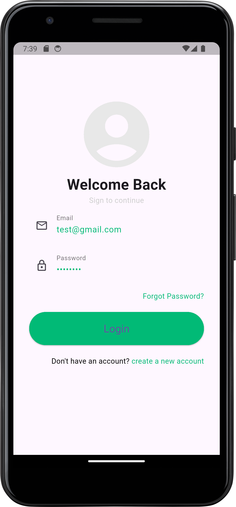
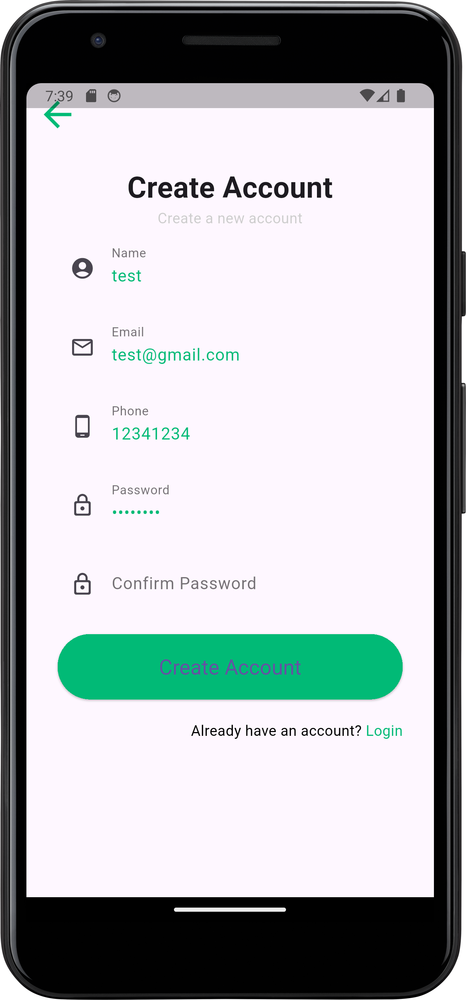

# Login & Register UI App (Flutter / Dart)

Aug 4, 2022 | It was created when I was in 12th grade, one of my early projects using Flutter, and in this project I tried to create a login and register display with navigation functions.

---

## Preview (Screenshots)

| Login | Register |
|---|---|
|  |  |

---

## Features

- Login page UI
- Register page UI
- Simple navigation between pages (basic flow)
- Flutter widget-based UI layout

---

## Tech Stack

- **Language:** Dart  
- **Framework:** Flutter  
- **Platform:** Android / iOS  
- **Tools:** Flutter SDK, Android Studio / VS Code  

---

## Project Structure (High Level)

- `lib/` - Flutter source code (pages/screens, widgets, navigation)
- `android/` - Android project files
- `ios/` - iOS project files
- `test/` - Unit/widget tests (if used)
- `pubspec.yaml` - Flutter dependencies & assets
- `docs/` - Screenshots for README

---

## Getting Started

### Requirements
- Flutter SDK installed
- Android Studio / VS Code (recommended)
- Android emulator or physical device (USB Debugging enabled)

### Run Locally
1. Clone the repository:
   ```bash
   git clone https://github.com/Aryosetowmn/mobiledev_kelas12semester1_port1.git
   ```
2. Install dependencies:
   ```bash
   flutter pub get
   ```
3. Run the app:
   ```bash
   flutter run
   ```

---

## Notes

This repository is intended for learning and portfolio demonstration.  
For real-world apps, consider adding input validation, state management (Provider / Riverpod / Bloc), and backend integration (Auth API / Firebase).

---

## Author

**Aryosetowmn**  
Repository: `Aryosetowmn/mobiledev_kelas12semester1_port1`
